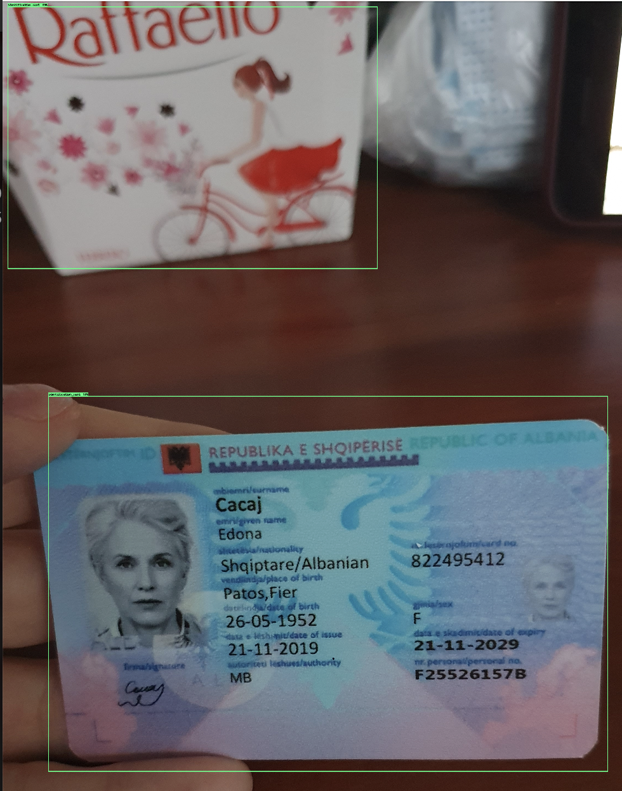

# ⣿⣤ Web application for ID classification project

## Description

A simple web application that identifies documents uploaded by the user, detects regions of interest (ROIs), and classifies the nationality of the document.

## Structure

1. app
   Microservices web application with a client-side created using React and HTML canvas. The server is a lightweight Flask API written in Python.
   - client: Simple react web app allowing upload image and call server to get classification
   - server: Web api server that host ml models
2. modeling
   The training process was meticulously documented within a Jupyter notebook, detailing each step undertaken to train the neural network model. This comprehensive record encompasses a thorough account of the data preprocessing steps, model architecture design, hyperparameter tuning, and the optimization process.

   The notebook methodically outlines the training iterations, including the epochs, batch sizes, and optimizer configurations employed. Furthermore, it includes the complete set of accuracy measurements, ensuring a comprehensive evaluation of the model's performance at each training stage.

3. doc
   support files (images, doc...)for main README.md

## Setup

1. client
   `yarn install`
2. server
   `make install`

## Run

1. With docker
   `docker-compose up`

2. Without docker
   `cd server && made dev`
   `cd client && yarn start`
